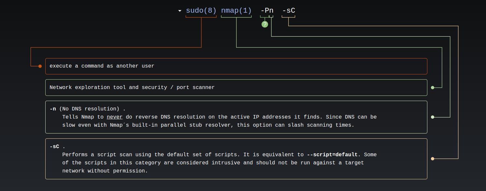
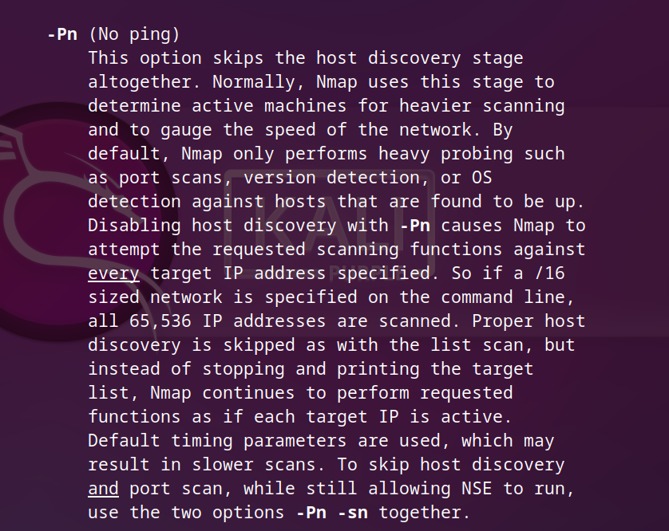
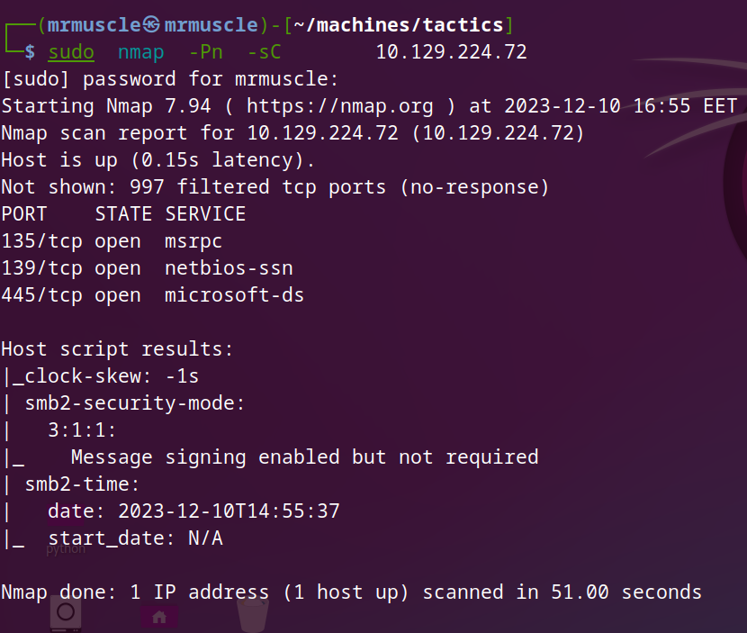
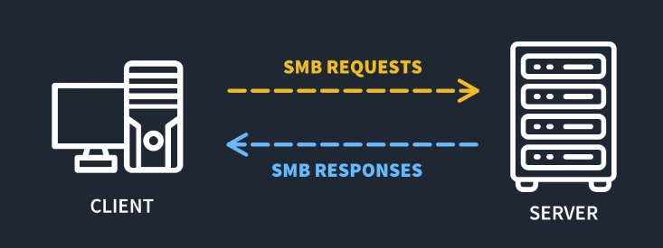
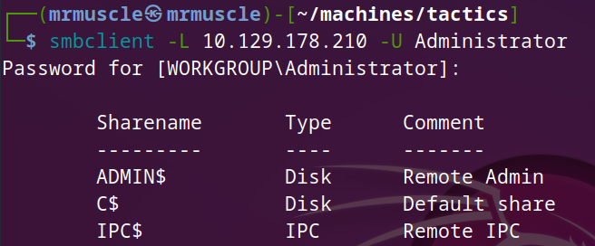
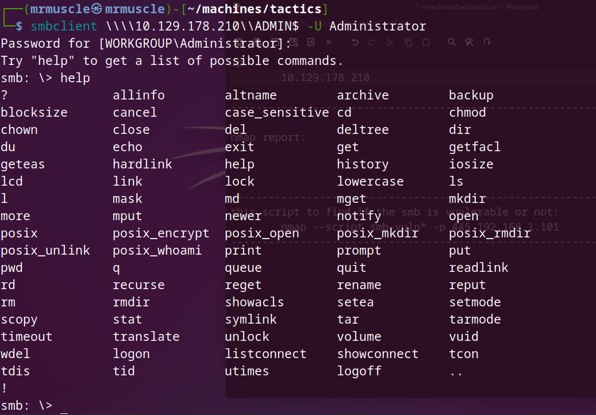
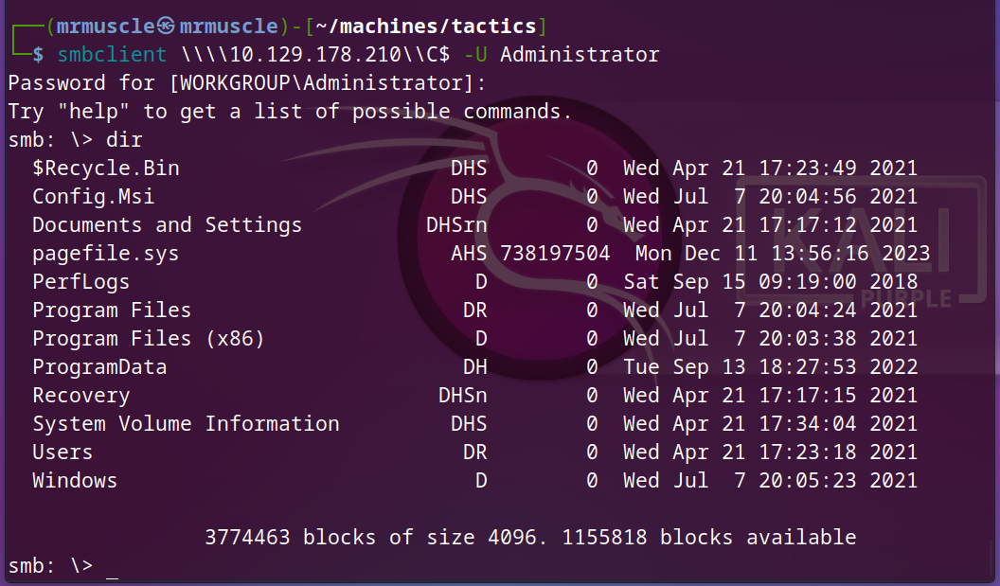
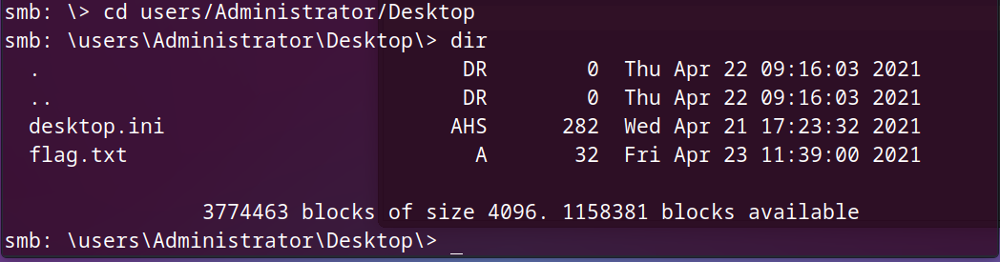
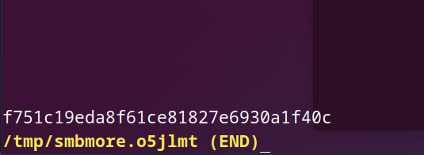

# Basics of penetration testing

***In our journy to learn penetration testing we takes a machines in HTB to can explain the basics of penetration***

## funnel Write-up

- After connecting with vpn you will spawn the machine and you will have the ip address for this machine .

- As we explained in earlier machines you must know how to download vpn and connect with HTB server and ping for IP_address .

### The idea of this machine is : see the following

- `SMB` , what is it , how to deal with it .
- `Administrator` login

### Enumeration :-

***And this is the first step you will begin with every time you performing an attack***

- we will begin with `nmap` tool to check what is the open ports in the target machine .

- we will use this command `sudo  nmap  -Pn  -sC  {IP_address}` , in the next image you can study what this command do.
- 

- we used a new switch with nmap to pass the firewall in this machine which is `-pn` , you can open the manual page for nmap and see all switches that you can execute just type in your terminal `man nmap` , you will got page llike this.

- 

- In the next image you will see the output of nmap tool :-

- 

- As you can see in the `nmap report` we got three open ports :-

  - `135/tcp` : open
    - service : `msrpc`  
    - version : `vsftpd 3.0.3`
    - And we can see that the `Anonymous FTP login allowed` , and this is very important information in our attack.
  
  - `139/tcp` :  open
    - service : `netbios-ssn`  
  
  - `445/tcp` :  open
    - service : `microsoft-ds`

- ***what should we do now ?***
  - we will search about every single port to know every potential information about it .

- When you google about the ports you will find the following:

  - `135/tcp` : Remote Procedure Call (RPC) port 135 is used in client/server applications (might be on a single machine) such as Exchange clients, the recently exploited messenger service, as well as other Windows NT/2K/XP software. If you have remote users who VPN into your network, you might need to open this port on the firewall to allow access to the Exchange server.
  - `139/tcp` : NetBIOS is a protocol used for File and Print Sharing under all current versions of Windows. While this in itself is not a problem, the way that the protocol is implemented can be. There are a number of vulnerabilities associated with leaving this port open.
  - `445/tcp` : Port 445 is dedicated to the Server Message Block (SMB) protocol, which allows you to share resources such as files and printers within a network using TCP.

    - **What is Server Message Block?**

      - Server Message Block (SMB) is the protocol that allows devices on the same network to communicate with each other and share resources such as files and printers through what is known as inter-process communication.

      - There are several different implementations of SMB, such as Common Internet File System (CIFS), which lets Windows devices share files. Samba is another implementation of SMB, which enables devices not running Windows share resources with those that are.

      - Over the years, Microsoft has developed a series of versions of SMB. For example, SMB 3 is a version that provides end-to-end encryption and support for virtualized environments.
      - 

- From the `NMAP report` and the previous information we got that the `port445/tcp` is the target port , and we learn the service run on it whic called `SMB` , let's find how to attack this port and know how to connect with it .

- we will use the `smbclient` tool , this tool is is a file sharing protocol, which means that we might extract some useful information by exploring it .

- To download this tool type in your terminal `sudo apt install smbclient` .
- After downloading the tool you can explore it's functionality by hitting help command in your terminal , Just type `smbclient --help` .
- After exploaring the help menu we find that :
  - `-L`: List available shares on the target.
  - `-U`: Login identity to use.

#### foothold

- To reach the target we will use this command `smbclient -L{terget_IP} -U Administrator` .
- 
- we use the username `Administrator` and the password will be blanked which mean just type enter when you asked about the password.
- As you can see in the previous image we listed all directory in the machine .
- So let's find what inside this directory, but before we begin , you must ask yourself **how did I know the syntax of using the smbclient command** , the answer is just search in google and you will got the syntax.
- let's begin with this command `smbclient \\\\{target_IP}\\ADMIN$ -U Administrator`.

- 
- As you can see we are in , when you type `help` you will get the list of every possible command we can use.
- when we explore the `ADMIN$` directory we find that we got nothing , so let's acces the `C$` directory to find the flag.
- `smbclient \\\\{target_IP}\\C$ -U Administrator`.

- 
- when you get inside the `C$` dir just type `dir` you will got all direcotry , we will open the `users` directory then open `Administrator` then go to `desktop` then read the `flag.txt` AS following.

- 

- To open the flag hit this command `more flag.txt`, and you can type `get flag.txt` and download the flag inside your machine but I prefer to read the flag and exit.
- 

- just click enter to read the flag and type `q` to exit the window after reading the flag.

- 

- We successfully got the flag!
- Congratulations , Assem_Ayman.
